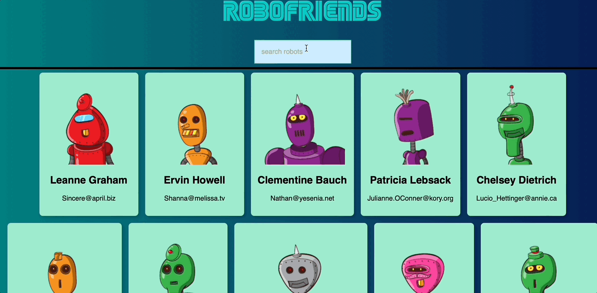

# RoboFriends

## What's inside?
What's inside this app:

- This app renders list of random profiles from an API.
- Each profile has it's own card component.
- Every profile gets a robot image taken from https://robohash.org
- User can filter the profile list from the SearchBox.

## Framework

This app uses <a href="https://reactjs.org/" target="_blank">ReactJS</a> framework for its development.

## Live Site

For a quick preview of the site, click the link below:

https://codemaster7.github.io/robofriends

## Technologies Used
### Front-end
- HTML5
- CSS3
- Javascript
- React
### Dependencies
- gh-pages
- tackyons

## Author
- Website - [Sam Bonfanti](https://sambonfanti.club/)
- Frontend Mentor - [@CodeMaster7](https://www.frontendmentor.io/profile/CodeMaster7)
- Linkedin - [sambonfanti](https://www.linkedin.com/in/sambonfanti/)

God Bless You! 😇
